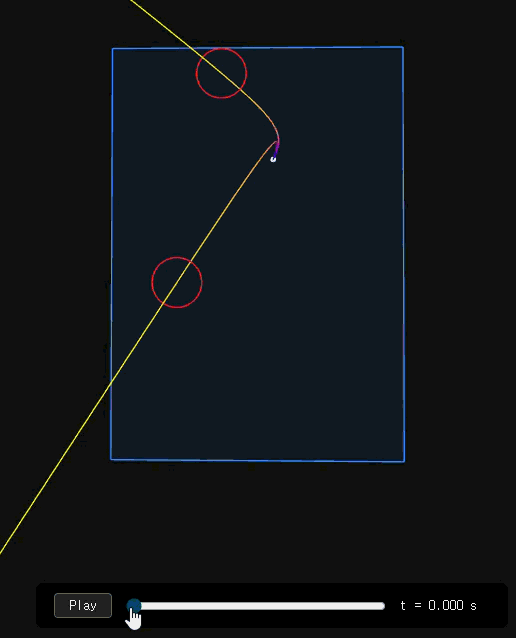

# throwing-gas

## About

This is a baseball pitch simulator. The repo contains a physics simulator, configuration tools, and plotting tools, with which you can do the follwing:

* Tweak around arm slots, spin rate, etc. to explore differences in pitch trajectories.
* Import data from Statcast to comapre, modify, and play with pitches actually thrown in the MLB.
* Create imaginary pitcher profiles or test "what if" scenarios.

Studies are being conducted to improve the accuracy of the simulations. Other studies focus on better understanding pitch types. A simple CLI tool has been built for utilizing Statcast, and more work is to come. For the latest work undertaken, see the following:

* [Back-computing initial velocity from Statcast](studies/init-v/back-computing-v.md)
* [What makes a fastball fast? (Other than yanking it has hard as one can.)](studies/fastballs/fastballs.md)
* [Optimizing for constant *K*](optimizing/optimizing.md)

## Authors and History

The original physics implementation was written in 2018/2019 by two undergraduate students, **June Jung** and **Richard Whitehill**. The code was then rewritten to provide a cleaner API by **C.D. Clark III**, who also worked on some machine-learning models to simulate the batter's response. This can be found at [CD3/BaseballSimulator](https://github.com/CD3/BaseballSimulator).

The present repository is maintained by June Jung. Some of the old code has been forked from `BaseballSimulator`, but much of the stuff here has been rebuilt from scratch. This repository focuses strictly on **accuracy, usability, and interpretability**.

## Try

### Simple two-way comparison

The below setup will give you a 4-seam fastball and a sinker to compare, thrown by an imaginary pitcher who's 6'2" with a 38-degree arm slot (which is nearly sidearm but still three-quarters). You can see what they mean by "tunneling" that confuses batters.

```bash
python main/launch.py "configs/examples/*" --plot
```

**Expected output** (the GIF had to resample the frame rate, so the animation is slowed down here):



### Using Statcast

While Statcast and Baseball Savant provide precise trackings of pitches and body mechanics, they lack a proper physics engine and therefore the ability to test imagined scenarios. Some examples include:

* Clayton Kershaw and Hyun-Jin Ryu, who played together for the Dodgers, reportedly shared with each other tips on their respective signature pitches: Kershaw's curveball and Ryu's changeup. But apparently, Kershaw's arm angle was simply not compatible with Ryu's changeup grip. If everything else stayed constant, what might it look like if Kershaw threw with Ryu's spin axis?
* Trey Yesavage's extremely high release point really confuses batters. Interestingly, his sliders break towards the *arm side* instead of the glove side. At what point does a slider act weirdly like his?

You can attempt to answer such questions by recreating the pitch in a simulation. Run `main/command.py` to launch a CLI tool that will help you search, select, and configure pitches from the Statcast database. The CLI tool uses `main/statcast-to-config.py`, which you can also run directly from the terminal with line arguments.

The above scripts rely on the [pybaseball](https://github.com/jldbc/pybaseball) package to retrieve raw values from the Statcast database. 

## Other Resources

See `docs/config-help.md` and `docs/pitch-frame.md` for making your own configs.\
See `configs/` for configs that are already prepared.\
See `studies/` for studies made using the simulator & plotter.
