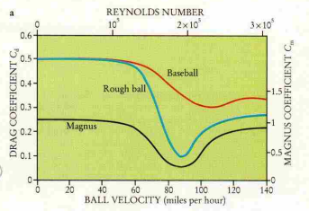

# New Assumptions for, and Subsequent Computing of, the Magnus Force and its Coefficient

## 1. Background

The physics implemented in the `phys` module calculates three force terms at every time interval: gravity, air drag, and deflection due to spin; the last of which is known as the Magnus force. Typically, it is expressed as a function of several variables, and understood to be proportional to the velocity squared:

$$ \vec{F}_{magnus} = C_L \cdot \vec{v}^2 $$

where $C_L$ is the "lift coefficient," which is itself a function of the object's spin, its radius, surface area, spin, air density, and velocity. 

But the original `phys` module assumed that, because baseballs are all we're interested in, things like air density and object's profile can be absorbed into one constant. Moreover, $C_L$ depends on a spin parameter $S$, which has a $1/v$ factor inside it. For baseballs traveling at the speed at which they do, $C_L$ comes out to be roughly proportional to $1/v$. For this reason, it was assumed that the squared velocity term can be canceled out. Thus, the equation implemented in `phys` expressed the Magnus term as follows:

$$ \vec{F}_{magnus} = \beta \cdot \vec{\omega} \times \vec{v} $$

where $\beta$ is a constant, $\omega$ is spin, and $v$ is velocity.

However, as you can see in [the optimization results](docs/k-results.md), I could not get the average error in acceleration down below ~2.35 $m/s^2$ over a batch of ten Statcast-tracked games. This is a pretty significant error, as the final displacement error at home plate can be as large as 8 inches. Hence, a refinement of the physics model is warranted. 

The first suspect of the large error is, of course, air density. It would presumably vary by ballpark and by weather. The Rockies' Coors field, for example, is known as a homerun-friendly park. A part of the reason is due to its altitude and consequent low air drag on the balls. We can imagine that it causes less breaks on pitches, as well. 

Another suspect is the ball's surface, which would be more difficult to model. The air around the ball (and equally importantly the air *behind* the ball) acts differently depending on how rough or smooth the surface of the baseball is. The trouble is that a baseball has seams. A even further trouble is that these seams are rotating at different axes depending on the pitch.

The same questions should be asked also for the air drag term, which can be similarly expressed as:

$$ \vec{F}_{drag}  = C_d \cdot \vec{v} $$

where $C_d$ is the drag coefficient, again a function of surface area, air density, and so on.

## 2. Literature
### 2.1. Coefficients are not easily predictable

Robert K. Adair (1995) noted that a baseball, given its typical range, lives within the transition from (a) leaving classical vortices behind it (due to the Prandtl boundary being intact), to (b) leaving turbulent air behind it (due to the boundary being blown away at higher speed). In this regard, he observed that a rougher ball may have less air drag than a smoother ball, countrary to intuition. He wrote:

> Baseball velocities are typically between 60 and 120 miles per hour, where the transition to turbulent flow — or "drag crisis" — causes $C_d$ to vary rapidly with velocity. A rotating baseball is neither uniformly smooth nor rough, since it presents both its smooth cover and raised stitching to the air. This smooths the transition somewhat.

The figure he presents with this explanation is interesting (see below). I don't really know how to factor this into my model, yet. We'll see.

Figure 3(a) from Adair (1995).
